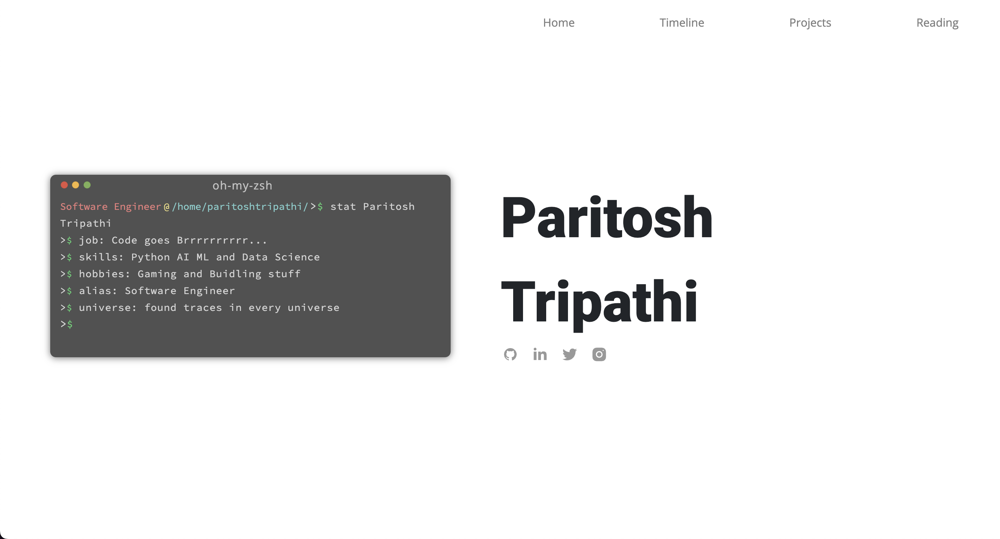

# Project Title: Flask Portfolio Website
## Images <a name="images"></a>

### Homepage

*Description: This is the homepage of my portfolio website, showcasing a clean and user-friendly design.*

## Table of Contents

- [About](#about)
- [Getting Started](#getting_started)
- [Usage](#usage)
- [Contributing](../CONTRIBUTING.md)

## About <a name = "about"></a>

This project aims to create a personal portfolio website using Flask, a web framework in Python. The portfolio website will showcase the developer's skills, projects, and experience. The use of Flask allows for easy customization and dynamic content updates.

## Getting Started <a name = "getting_started"></a>

These instructions will guide you on setting up the project on your local machine for development and testing purposes.

### Prerequisites

To run the project, you need to have the following installed:

- Python
- Flask

You can install Flask using the following command:

```bash
pip install Flask
```
Installing
Follow these steps to get the development environment up and running:

1. Clone the repository to your local machine:

```bash
git clone https://github.com/paritoshtripathi935/portfolio-flask
```

# Navigate to the project directory:
```
cd flask-portfolio
```

# Install the required dependencies:
```
pip install -r requirements.txt
```

# Run the Flask application:
```
python app.py
```

The application should now be running locally. Open your web browser and go to http://localhost:5000 to view the portfolio website.

## Usage <a name = "usage"></a>

The portfolio website serves as a showcase of the developer's skills and projects. Customize the content by editing the templates and static files in the project. Update the `.json` files in static folder to include information about your projects and experiences.

## Contributing

If you'd like to contribute to this project, please follow the guidelines outlined in the [CONTRIBUTING.md](CONTRIBUTING.md) file.

Feel free to fork the repository, make your changes, and submit a pull request. Your contributions are highly appreciated!


